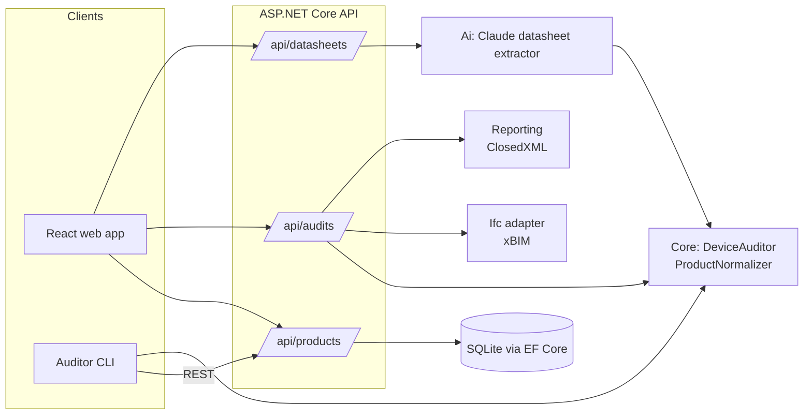

# MepCatalog

[](https://github.com/safo-124/cnet/actions/workflows/ci.yml)

**A product catalog and BIM model auditor for building services (HVAC and electrical) design.**

**Live demo: https://mepcatalog.135.181.93.156.nip.io** (open *Model audit* and use the sample model link)

Designers place hundreds of air terminals, fans, dampers and light fixtures in a building model, and each one should carry
correct product data: airflow, power, connection size, weight. Filling this in by hand is slow and error-prone, and the data
goes out of date when manufacturers update their datasheets.

MepCatalog keeps that product data in one central catalog and checks building models against it:

- **Catalog**: import messy manufacturer CSV files (mixed units, Finnish and English terms) or read **PDF datasheets with AI**, then review and save.
- **Audit**: open an IFC model, find every device with missing or outdated data, and fill it in from the catalog automatically.
- **Report**: give designers an Excel to-do list of the things that need a person's decision.

> All manufacturers, products and datasheets in this repository are fictional sample data.


## Features

| | |
|---|---|
| **Catalog API** | ASP.NET Core REST API with search, filtering, paging, validation and CSV import. Re-importing updates products instead of duplicating them. |
| **Unit normalization** | `"180 m3/h"` → 50 l/s, `"0,18 kW"` → 180 W, `"Ø160"`/`"DN160"` → 160 mm. Finnish categories (`tuloilmalaite`, `puhallin`, `palopelti`, `valaisin`) are recognised. |
| **IFC model auditor** | Reads IFC4 models with [xBIM](https://github.com/xBimTeam/XbimEssentials), matches each device to the catalog via the standard `Pset_ManufacturerTypeInformation`, and classifies it as *OK*, *needs update*, *unidentified*, *not in catalog* or *wrong product type*. |
| **Auto-fix** | Writes catalog values back into the model and records which catalog product they came from, so the change is traceable. |
| **Audit history** | Every audit is saved and grouped by the model's IFC project GlobalId, which stays the same when a file is fixed, re-exported or renamed. A chart shows the model improving from audit to audit. |
| **Excel report** | Summary, a filterable device list, a *designer actions* to-do sheet with a "Done" column, and every value change. |
| **AI datasheet reading** | Upload a manufacturer PDF; Claude reads the product table, the values go through the same normalizer as the CSV import, and a person reviews them before anything is saved. |
| **Web UI** | React + TypeScript + shadcn/ui: catalog management, drag-and-drop model audit, and downloads of the fixed model and report. |
| **CLI** | `MepCatalog.Auditor audit model.ifc --report audit.xlsx --fix fixed.ifc`, with a non-zero exit code while problems remain, so it can gate a pipeline. |
| **Revit add-in** | [`src/MepCatalog.Revit`](src/MepCatalog.Revit): a *MepCatalog* ribbon tab in Revit 2026 that audits the open model with the same rules, fills catalog values into shared parameters in one undoable step, selects the devices that need a designer, and saves the Excel report. |
| **Python data-quality tool** | [`tools/catalog-quality`](tools/catalog-quality) batch-imports a folder of manufacturer files over the REST API and checks the catalog: missing key data, implausible duct air velocities, fan efficiency (SFP) and spelling-variant duplicates. |

## Architecture



| Project | Responsibility |
|---|---|
| `MepCatalog.Core` | Domain model and rules: product, unit parsing, normalization, **the audit logic**. No dependencies on files, databases or frameworks. |
| `MepCatalog.Data` | EF Core + SQLite, migrations, CSV reader, import/upsert service, catalog lookup. |
| `MepCatalog.Ifc` | Thin adapter between IFC4 (xBIM) and the core `ModelDevice` record, plus a sample model generator. |
| `MepCatalog.Reporting` | Excel and CSV audit reports. |
| `MepCatalog.Ai` | Claude-based PDF datasheet extraction (optional). |
| `MepCatalog.Api` | REST API with OpenAPI docs (Scalar UI at `/scalar`). |
| `MepCatalog.Client` | HTTP client for the catalog API, shared by the CLI and the Revit add-in. |
| `MepCatalog.Revit` | Revit 2026 add-in: a thin Revit adapter over the shared audit rules. |
| `MepCatalog.Auditor` / `MepCatalog.Importer` | Command-line tools. |
| `web/` | React 19 + TypeScript + Vite + Tailwind + shadcn/ui + TanStack Query. |
| `tools/catalog-quality/` | Python 3.12 CLI over the REST API (requests, pytest, ruff). |

## Design decisions

- **The auditor doesn't know about IFC.** `DeviceAuditor` works on a format-neutral `ModelDevice` record. IFC is one adapter and the Revit add-in is another (under 200 lines), both over the same, already-tested rules.
- **AI reads, code calculates.** Claude returns each value *exactly as printed* ("432 m3/h"), constrained by a JSON schema. Unit conversion runs through the same tested `ProductNormalizer` as the CSV import, so a language model never does arithmetic on engineering data.
- **A person approves AI output.** Extraction only proposes products. Each one shows the converted value next to the value as printed, problems are flagged, and nothing is saved until the user confirms.
- **Don't guess.** Devices with no product, an unknown product or the wrong kind of product are never "fixed" automatically. They go on the designer's to-do list instead.
- **Edit models safely.** A property set shared by several elements is never edited in place, so fixing one device can't silently change another.
- **The AI feature is optional.** Without an API key the app works normally and the feature explains how to enable it. Tests never call the paid API.

## Getting started

Prerequisites: [.NET 9 SDK](https://dotnet.microsoft.com/download) and [Node.js 22.12+](https://nodejs.org).

```bash
# 1. API (creates the SQLite database on first run) -> http://localhost:5236/scalar
dotnet run --project src/MepCatalog.Api

# 2. Load the sample catalog (in a second terminal)
dotnet run --project src/MepCatalog.Importer -- data/sample-products.csv --db src/MepCatalog.Api/mepcatalog.db

# 3. Web app -> http://localhost:5173
cd web
npm install
npm run dev
```

Then open **Model audit** and drop in `data/sample-building.ifc`.

### Command line

```bash
dotnet run --project src/MepCatalog.Auditor -- audit data/sample-building.ifc --report audit.xlsx --fix fixed.ifc
dotnet run --project src/MepCatalog.Auditor -- sample my-test-model.ifc
```

### Enabling AI datasheet reading (optional)

Create an API key in the [Anthropic Console](https://console.anthropic.com) and store it with .NET user-secrets, which keeps it outside the repository:

```bash
dotnet user-secrets set "Anthropic:ApiKey" "<your key>" --project src/MepCatalog.Api
```

Restart the API, then use **Catalog → From datasheet** with `data/datasheets/nordic-air-ka-series.pdf`. The `ANTHROPIC_API_KEY` environment variable also works.

### Running with Docker

```bash
docker build -t mepcatalog .
docker run -p 8080:8080 -v mepcatalog-data:/data mepcatalog   # -> http://localhost:8080
```

The image runs in demo mode: the sample catalog is loaded on first start and the sample files can be downloaded from the app. See [deploy/README.md](deploy/README.md) for the public HTTPS deployment with Caddy.

## Tests and CI

```bash
dotnet test
```

68 .NET tests cover unit parsing, normalization, the audit rules, an IFC round trip (create → audit → fix → save → reopen → audit again), the Excel report contents, demo mode, and the HTTP API end to end against an in-memory database. The Python tool has 24 more tests of its own.

GitHub Actions builds the solution with warnings as errors and runs the .NET tests on Linux, lints and tests the Python tool, and type-checks, lints and builds the web app on every push.

## Limitations and next steps

- **Revit add-in**: built against the Revit 2026 API and compiled in CI, but not yet run inside Revit itself (see [its README](src/MepCatalog.Revit/README.md)).
- **Standard property sets**: technical values currently live in a `MepCatalog_ProductData` set; mapping to standard IFC sets such as `Pset_AirTerminalTypeCommon` is the next step.
- **IFC2x3**: only IFC4 is supported. IFC2x3 models represent these devices as generic `IfcFlowTerminal` / `IfcFlowController` elements with type objects, which needs its own adapter.
- **Authentication and hosting**: the API has no login yet. The natural production setup is Azure App Service + Azure SQL with Entra ID sign-in.
